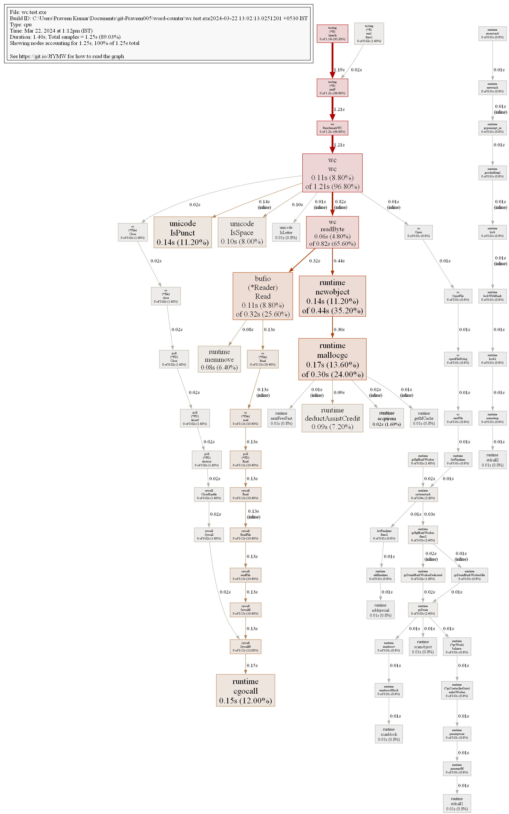

## Running the Program

Build the Program:

```
go build -o main
```

Run the program:
```
./main
```
To print statistics about the resource usage of the command, including the elapsed real time, user CPU time, and system CPU time:
```
time ./main
```
Output would look like:
```
"ego.txt": 160578

real    0m2.102s
user    0m0.005s
sys     0m0.027s
```
> `real`: Elapsed real (wall-clock) time. This is the actual time taken from the start to the end of the command's execution.
>
> `user`: CPU time spent in user-mode code (outside the kernel). This includes the time spent executing your program's code.
>
> `sys`: CPU time spent by the kernel on behalf of the command. This includes time spent on system calls and other kernel operations.


If you want to compare it with the inbuilf `wc` command:
```
time wc -w fileName.txt
```

> Note: The `time` command is useful for profiling and understanding the performance characteristics of our programs.


## Benchmarking

```
go test -bench=BenchmarkWC -benchmem
```

### Baseline:

**<u>Benchmarking Result:</u>**
```
"ego.txt": 160578
goos: windows
goarch: amd64
pkg: wc
cpu: AMD Ryzen 5 5500U with Radeon Graphics
BenchmarkWC-12                 1        2029952200 ns/op         1018296 B/op    1015315 allocs/op
PASS
ok      wc      2.368s
```
**<u>Time Stats:</u>**
```
"ego.txt": 160578

real    0m2.406s
user    0m0.003s
sys     0m0.076s
```
<u>Resource Stats for standard `wc` command:</u>
> Note: There's a difference between word count here, that is because, there are some forms of words that I'm not considering.
```
161916 ego.txt

real    0m0.117s
user    0m0.020s
sys     0m0.076s
```

**<u>Profiling:</u>**

**CPU Profile:**
```
go test -cpuprofile cpu.prof -bench .
```

**Visualize the profile in web:**
```
go tool pprof -http=:8080 cpu.prof
```


**Want a PNG image of the profile?**

Enter the interactive pprof shell:
```
go tool pprof cpu.prof
```
Now type `png` in there and press `Enter`

**Want more control?**

Specify the output file name and create image of a particular binary:
```
go tool pprof -output="profile.png" wc.test.exe cpu.prof
```
This will again open `pprof` interactive shell. Type in `png` there and press `Enter`
> Note: Enter your own binary file name in place of `wc.test.exe`


## Optimization

1. Buffered Reading: Instead of reading Byte by Byte, we'll read the data in chunks and store in internal buffer, thereby reducing the number of direct interactions with the file.

This improves the performance significantly:

**<u>Benchmark:</u>**
```
goos: windows
goarch: amd64
pkg: wc
cpu: AMD Ryzen 5 5500U with Radeon Graphics
BenchmarkWC-12                52          24686375 ns/op         1020061 B/op    1015300 allocs/op
PASS
ok      wc      1.660s
```
**<u>Time Stats for our program:</u>**
```
"ego.txt": 160578

real    0m0.153s
user    0m0.003s
sys     0m0.026s
```
**<u>Time Stats for inbuilt `wc` command(for comparison):</u>**
```
161916 ego.txt

real    0m0.119s
user    0m0.013s
sys     0m0.066s
```


## More
The above way of create profile is based on using the command line flags. Use it when you need the profile of the complete program.

If you want to create profile for a particular block of code do the following:
```
cpuProfileFile, err := os.Create("cpu_profile.prof")
	if err != nil {
		fmt.Fprintf(os.Stderr, "Error creating CPU profile file: %v\n", err)
		os.Exit(1)
	}
	defer cpuProfileFile.Close()
	pprof.StartCPUProfile(cpuProfileFile)
	----- your code here------
	pprof.StopCPUProfile()
```
To create the profile, simply run:
```
go run main.go
```
It will create a cpu_profile.prof file.

To analyze:
```
go tool pprof cpu_profile.prof
```
Then type in `web` inside the `pprof` shell and press `Enter`
Aliter:
```
go tool pprof -http=:8080 cpu_profile.prof
```